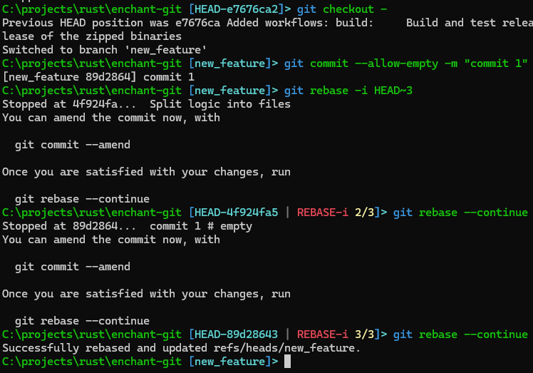

# enchant-git

`enchant-git` is a simple prompt replacement intended to display the state of a git repo in the current directory.
It's made to be reasonably fast, so navigating the command line is quick and painless while still showing useful git information such as current branch, merge/rebase state, ongoing operations, etc.

# 
